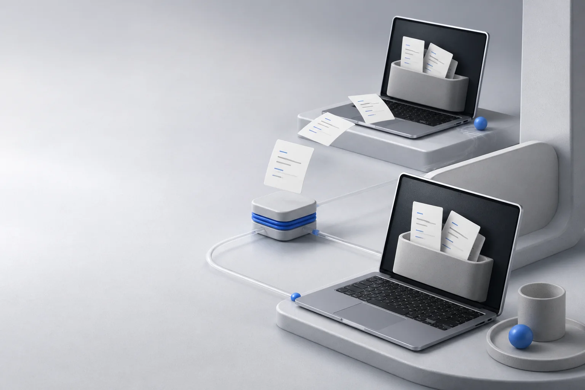

# memory-sync - multi-device memory sync for AI agents

**Keep your AI agent's memory in sync across every device - automatically, safely, and self-hosted.**

[](LICENSE)
[](client/pyproject.toml)


> **Try the live demo:** [https://sync.chuanpiao.ltd](https://sync.chuanpiao.ltd) - register an account and sync a folder from two devices in under 5 minutes.



Your memory lives in Markdown files: `CURRENT.md`, `TERMS.md`, daily notes, long-term knowledge. With memory-sync you stop manually copying them between your work PC, home PC, and phone - the files stay identical everywhere, and nothing is ever silently overwritten.

## Why memory-sync?

| Your pain | memory-sync |
|---|---|
| Memory scattered across devices and agents | **One click sync**: all ends converge to the same files |
| Scared of losing notes after a reinstall | **Versioned history** in PostgreSQL - every change is an event |
| Don't trust cloud sync that overwrites your edits | **Conflicts never overwrite**: server copies go to `conflicts/<timestamp>/`, your local file stays untouched |
| Don't want to give your private notes to a SaaS | **100% self-hosted**: one `docker compose up` on any 2 GB VPS |
| CLI tools that need a PhD to set up | **One command**: `pip install ./client` then `memory-sync sync ./notes` |

## Features

- **Incremental sync** - only changed files are transferred; the client keeps a local hash snapshot and pushes only files whose content changed
- **Pull-then-push** - a sync run always pulls server events first, so a fresh local edit is never blindly overwritten by an older push
- **Conflict-safe by design** - optimistic concurrency with `base_version_id`; real conflicts are diverted to `conflicts/<UTC>/<path>`, never overwritten
- **Deletes that behave** - tombstones propagate to every device; local edits against a remote delete are preserved
- **Ed25519 device signatures** - every request is signed by a per-device key with nonce + timestamp anti-replay
- **Account isolation (RLS)** - PostgreSQL row-level security: each user can only ever see their own documents
- **Zero third-party services** - PostgreSQL + FastAPI + Caddy only; no Redis, no queues, no SaaS
- **Tiny footprint** - runs comfortably on a 2 vCPU / 2 GiB VPS (~1 GiB for all containers)
- **zstd + gzip compression** on every response via Caddy
- **Optional invite-code gate** - leave `REGISTRATION_INVITE_CODE` empty for open registration, set it to lock down your server

## How it works

```
+------------+   HTTPS (Caddy, TLS 1.3)   +------------------+
|  Device A  | --------------------------> |   memory-sync   |
|  (CLI +    |  pull events (seq cursor)   |     server       |
|  .md files)| <-------------------------- |  FastAPI + PG16  |
+------------+                             |   + RLS + Caddy  |
+------------+                             +------------------+
|  Device B  | -- same protocol ---------> (single source of truth)
|  (CLI +    |
|  .md files)|
+------------+
```

Each sync run (client side):

1. **Pull** - fetch events after the last known `seq`, apply them to disk (conflicting server copies go to `conflicts/`)
2. **Push** - hash every local Markdown file, upload only files whose hash changed, tagged with the `base_version_id` they were edited from
3. **Converge** - the server rejects a push whose base is stale (409) and the client pulls again, so every device ends at the same state

The server stores immutable file versions plus an append-only event log, so the full history can always be replayed or inspected.

## Quickstart (5 minutes)

### 1. Run the server (any Linux VPS or Docker machine)

```bash
git clone https://github.com/chenyanze66/memory-sync.git
cd memory-sync
cp .env.example .env
# edit .env: set SYNC_DOMAIN, ACME_EMAIL, and replace all replace-with-* values
docker compose up -d
curl -fsS https://your-domain.com/readyz   # -> {"status": "ready"}
```

That's it - PostgreSQL, the API, and Caddy (with automatic HTTPS) are up.

### 2. Install the client (Windows / macOS / Linux)

```bash
pip install ./client          # or: pipx install ./client
memory-sync register --server https://your-domain.com --email you@example.com --display-name me
memory-sync sync ./notes      # run any time, or set up a cron/scheduled task
```

On the second device:

```bash
memory-sync login --server https://your-domain.com --email you@example.com
memory-sync sync ./notes
```

Your `notes/` folders now stay identical on both machines. Add a scheduled task (Windows Task Scheduler / `crontab`) and it's fully automatic.

### Commands

| Command | What it does |
|---|---|
| `memory-sync register` | Create an account (invite code optional) and register this device |
| `memory-sync login` | Log in on another device and bind a new device key |
| `memory-sync status` | Show account, device, last sync time |
| `memory-sync sync <dir>` | Pull pending events, then push local changes |

## Project layout

```
memory-sync/
|-- server/          # FastAPI sync service (PostgreSQL + RLS + Ed25519 signing)
|   |-- api/         #   the application
|   `-- db/          #   schema + app-role bootstrap (runs on first boot)
|-- client/          # Python CLI (stdlib + cryptography only)
|   `-- memory_sync_client/
|-- docs/            # diagrams and screenshots
|-- docker-compose.yml
|-- Caddyfile
`-- .env.example
```

## Security model

- **Transport**: HTTPS only (Caddy auto-renews Let's Encrypt certs), zstd/gzip encoded responses
- **Passwords**: Argon2id hashed; missing accounts burn the same verify time (no user enumeration)
- **Tokens**: short-lived access JWT (HS256) + rotating refresh tokens stored in the user's private config
- **Device identity**: Ed25519 keypair per device; requests signed with canonical `METHOD\nPATH\nTS\nNONCE\nSHA256(body)` and a nonce replay window
- **Tenant isolation**: PostgreSQL `FORCE RLS` with a `NOBYPASSRLS` app role; the user id is injected per transaction
- **No secrets in the repo**: everything is configured through `.env`

## Roadmap

- [x] v0.1 - sync core (pull/push, conflicts, tombstones, device signing, RLS)
- [ ] Remote control channel - send a task from your phone to your PC's agent
- [ ] Version history + rollback commands
- [ ] Semantic search over memories (pgvector)
- [ ] Web UI / shared spaces

## Development

```bash
cd server && python -m pytest tests/        # server pure tests
cd client && python -m pytest tests/        # client tests (fake transport, offline)
```

## License

[MIT](LICENSE) (c) 2026 Chen Yanze

---

<p align="center"><b>If memory-sync saves you from one manual copy-paste, give it a star.</b></p>

---

## 中文说明

**memory-sync** - 给 AI Agent 用的多端记忆同步工具：把 `CURRENT.md`、`TERMS.md`、日记等 Markdown 记忆文件在电脑、手机之间自动保持一致，自己部署、数据自己掌控。

- **5 分钟跑通**：服务器一条 `docker compose up`，客户端 `pip install ./client` 后 `memory-sync sync ./notes`
- **绝不静默覆盖**：冲突时服务端副本落 `conflicts/<时间戳>/`，本地文件永远保留
- **只传增量**：客户端维护哈希快照，只有变化的文件才上传
- **安全默认**：HTTPS + Argon2id 密码 + Ed25519 设备签名 + PostgreSQL RLS 账号隔离
- **资源占用小**：PostgreSQL + FastAPI + Caddy 三容器合计约 1 GiB，2G 小服务器就能跑

### 快速开始

```bash
git clone https://github.com/chenyanze66/memory-sync.git
cd memory-sync
cp .env.example .env   # 填入你的域名和随机密钥（邀请码留空=开放注册）
docker compose up -d
```

```bash
pip install ./client
memory-sync register --server https://你的域名 --email 你@example.com --display-name 我
memory-sync sync ./notes
```

另一台设备 `memory-sync login` 后 `memory-sync sync ./notes` 即可，之后两边自动一致。

如果你觉得有用，点个 star 支持一下。
