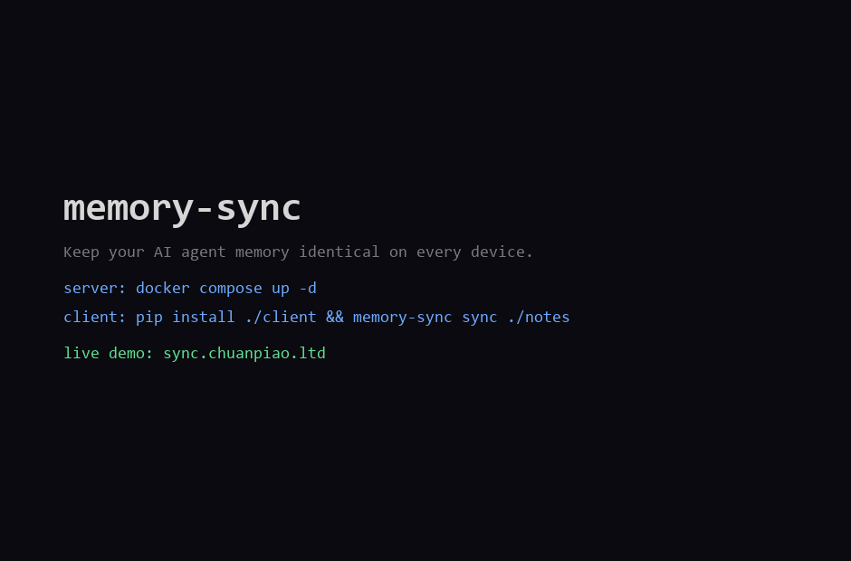

# memory-sync - multi-device memory sync for AI agents

**English** | [中文文档](README.zh-CN.md)

**Keep your AI agent's memory in sync across every device - automatically, safely, and self-hosted.**

> **Try the live demo:** [https://sync.chuanpiao.ltd](https://sync.chuanpiao.ltd) - register an account and sync a folder from two devices in under 5 minutes.

Your memory lives in Markdown files: `CURRENT.md`, `TERMS.md`, daily notes, long-term knowledge. With memory-sync you stop manually copying them between your work PC, home PC, and phone - the files stay identical everywhere, and nothing is ever silently overwritten.

## Why memory-sync?

| Your pain | memory-sync |
|---|---|
| Memory scattered across devices and agents | **One click sync**: all ends converge to the same files |
| Scared of losing notes after a reinstall | **Versioned history** in PostgreSQL - every change is an event |
| Don't trust cloud sync that overwrites your edits | **Conflicts never overwrite**: server copies go to `conflicts/<timestamp>/`, your local file stays untouched |
| Don't want to give your private notes to a SaaS | **100% self-hosted**: one `docker compose up` on any 2 GB VPS |
| CLI tools that need a PhD to set up | **A Skill you just talk to**: drop in the skills folder, then say "sync my memory" |

## Features

- **Incremental sync** - only changed files are transferred; the client keeps a local hash snapshot and pushes only files whose content changed
- **Pull-then-push** - a sync run always pulls server events first, so a fresh local edit is never blindly overwritten by an older push
- **Conflict-safe by design** - optimistic concurrency with `base_version_id`; real conflicts are diverted to `conflicts/<UTC>/<path>`, never overwritten
- **Deletes that behave** - tombstones propagate to every device; local edits against a remote delete are preserved
- **Ed25519 device signatures** - every request is signed by a per-device key with nonce + timestamp anti-replay
- **Account isolation (RLS)** - PostgreSQL row-level security: each user can only ever see their own documents
- **Zero third-party services** - PostgreSQL + FastAPI + Caddy only; no Redis, no queues, no SaaS
- **Tiny footprint** - runs comfortably on a 2 vCPU / 2 GiB VPS (~1 GiB for all containers)
- **zstd + gzip compression** on every response via Caddy
- **Optional invite-code gate** - leave `REGISTRATION_INVITE_CODE` empty for open registration, set it to lock down your server