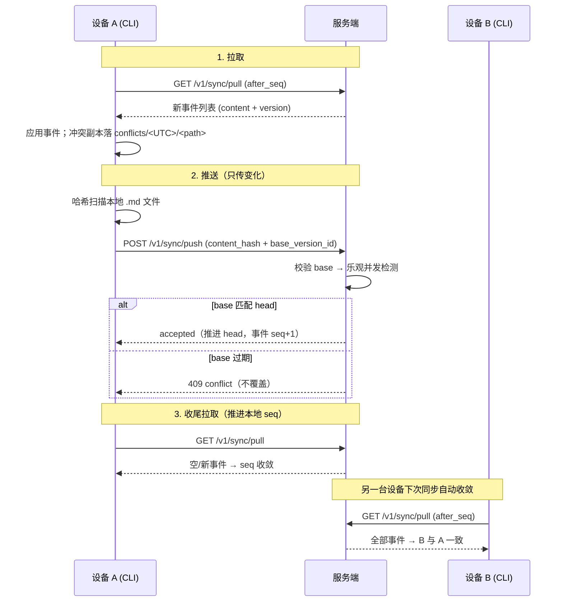
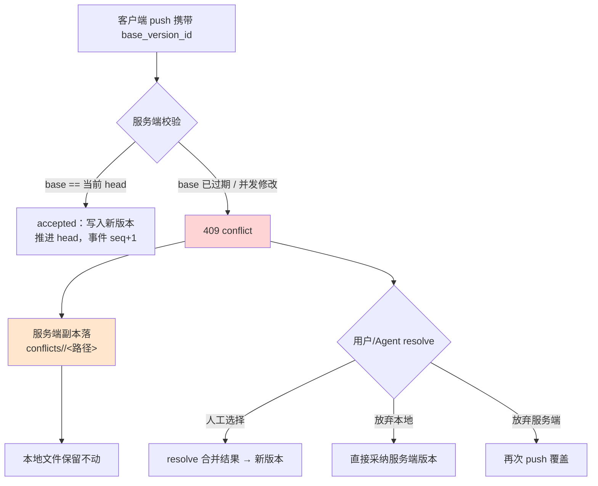
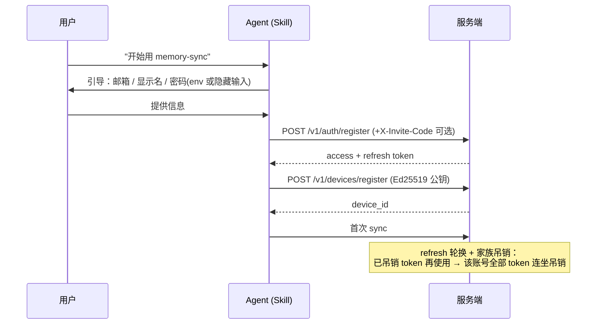

# memory-sync 架构与流程图

## 1. 系统架构（三层）

```mermaid
flowchart TB
    U1[用户 A] -->|自然语言对话| A1[Agent A<br/>(memory-sync Skill)]
    U2[用户 B] -->|自然语言对话| A2[Agent B<br/>(memory-sync Skill)]
    A1 -->|调用 CLI 命令| C1[CLI 薄运行时<br/>transport + 本地状态]
    A2 -->|调用 CLI 命令| C2[CLI 薄运行时<br/>transport + 本地状态]
    C1 -->|HTTPS /v1/*| S[服务端<br/>FastAPI]
    C2 -->|HTTPS /v1/*| S
    S --> PG[(PostgreSQL 16<br/>RLS + 事件日志 + 版本)]
    S --> CAD[Caddy<br/>TLS 1.3 + zstd]
    CAD -->|自动续期| LE[Let's Encrypt]

    style A1 fill:#d4f0ff
    style A2 fill:#d4f0ff
    style C1 fill:#e6ffe6
    style C2 fill:#e6ffe6
    style S fill:#fff3d4
```

## 2. 一次同步周期（pull → push → pull）



## 3. 冲突处理流程



## 4. 删除（tombstone）传播

```mermaid
flowchart LR
    DEL[设备 A 删除 TERMS.md] --> PUSH[push deleted=true<br/>content_hash=sha256('')]
    PUSH --> S[服务端写入 tombstone 版本<br/>事件 seq+1]
    S --> PULL[设备 B 下次 pull<br/>收到 deleted 事件]
    PULL --> APPLY[设备 B 本地删除该文件]
    PULL --> EDGE{设备 B 本地有未推送修改?}
    EDGE -->|是| KEEP[保留本地文件 → conflicts/]
    EDGE -->|否| OK2[正常删除，两端一致]
```

## 5. 认证与设备注册



## 6. GitHub 流水线（发布 / 部署）

```mermaid
flowchart LR
    PUSH[push main] --> CI[workflow: tests<br/>client 54 + server 20 测试]
    TAG[打 tag v*] --> REL[workflow: release<br/>构建客户端 zip + checksums<br/>docker 构建检查 → 附加到 Release]
    MAN[手动触发] --> DEP[workflow: deploy<br/>打包 server/ → scp 到 ECS]
    DEP --> SSH[ssh 部署脚本]
    SSH --> BK[备份 memory-sync-2g.bak-时间戳]
    SSH --> OV[覆盖 server/ 代码<br/>保留 .env / compose / site]
    SSH --> ZIP[更新官网客户端 zip + checksums]
    SSH --> BUILD[docker compose build api<br/>ACR 基础镜像 + 阿里云 pip 源]
    SSH --> UP[docker compose up -d api]
    SSH --> HC[curl readyz 健康检查]
    HC -->|ready| DONE[DEPLOY_OK ✅]
